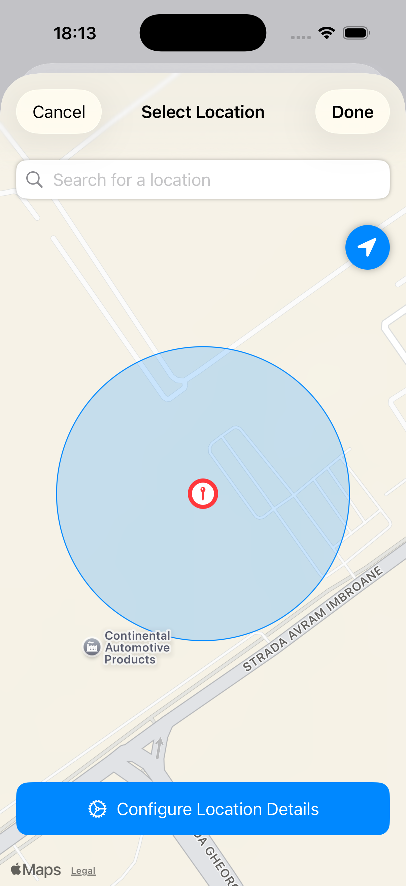
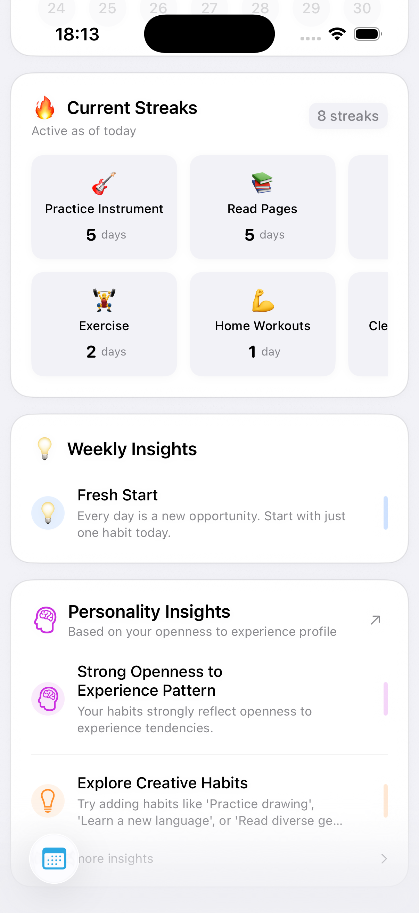
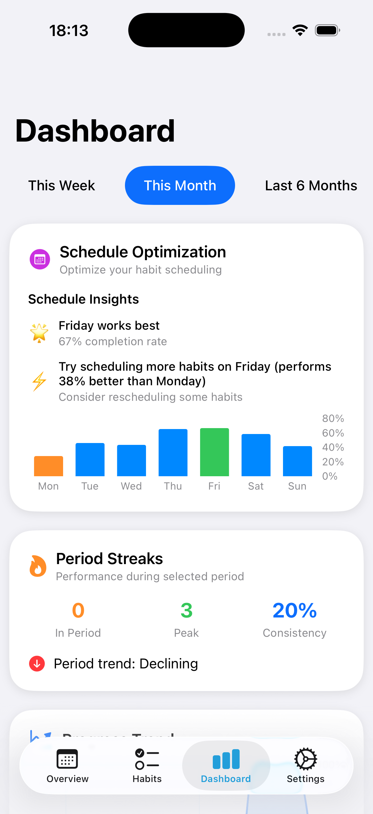
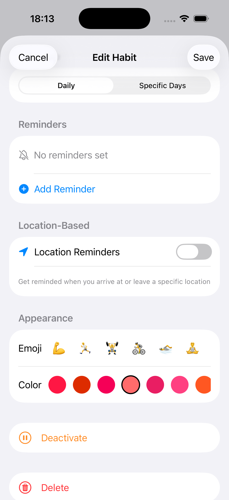
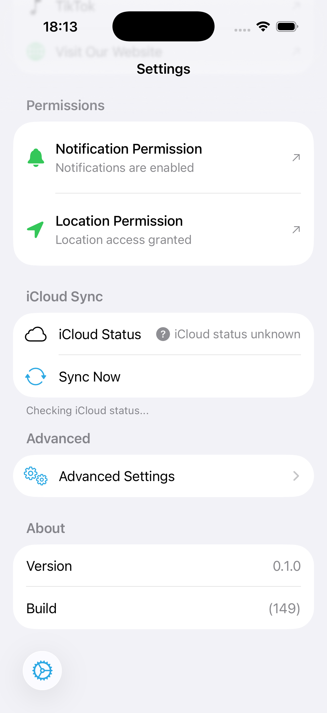
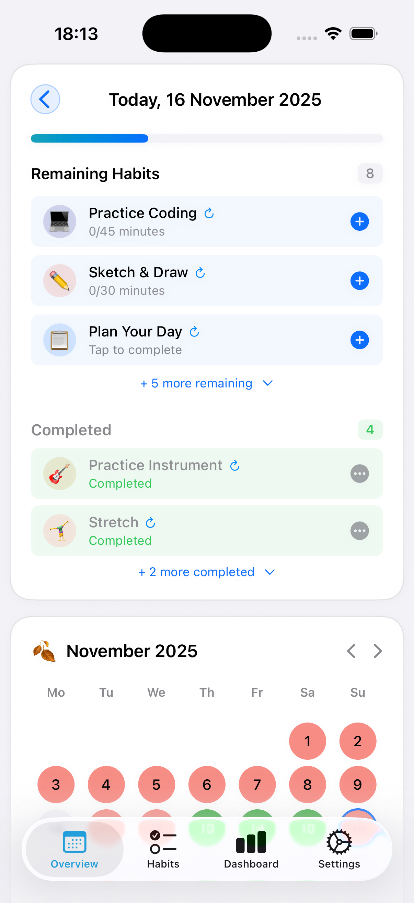

# Ritualist Website

Modern landing page for [Ritualist](https://github.com/vladblajovan/Ritualist) - an iOS habit tracker that knows you.

## Overview

This is the official marketing website for Ritualist, a modern iOS habit tracking app built with SwiftUI. The website showcases the app's key features including location-based reminders, AI personality insights, beautiful analytics, and more.

**Live Demo:** Coming soon

## Features

- 🎨 Modern, clean design with smooth animations
- 🌓 Full dark/light mode support
- 📱 Fully responsive layout
- 🖼️ Real iOS app screenshots
- 💫 Scroll animations with Framer Motion
- 🎲 Random taglines with smart rotation
- 📊 Stats, testimonials, and FAQ sections
- 💰 Pricing tiers with actual app prices
- ✉️ Email waitlist integration
- 🔗 Social media links

## Tech Stack

- **Framework:** [Next.js 16](https://nextjs.org/) (App Router)
- **Language:** TypeScript
- **Styling:** [Tailwind CSS v3](https://tailwindcss.com/)
- **Animations:** [Framer Motion](https://www.framer.com/motion/)
- **Icons:** [React Icons](https://react-icons.github.io/react-icons/)
- **Fonts:** Geist Sans & Geist Mono

## Getting Started

### Prerequisites

- Node.js 18+
- npm, yarn, pnpm, or bun

### Installation

1. Clone the repository:
```bash
git clone https://github.com/vladblajovan/RituliastWebsite.git
cd RituliastWebsite
```

2. Install dependencies:
```bash
npm install
```

3. Run the development server:
```bash
npm run dev
```

4. Open [http://localhost:3000](http://localhost:3000) in your browser

### Build for Production

```bash
npm run build
npm start
```

## Project Structure

```
RituliastWebsite/
├── app/
│   ├── page.tsx          # Main landing page
│   ├── layout.tsx        # Root layout with metadata
│   └── globals.css       # Global styles
├── public/
│   └── screenshots/      # iOS app screenshots
├── tailwind.config.ts    # Tailwind configuration
└── package.json          # Dependencies
```

## Deployment

The easiest way to deploy this Next.js app is to use [Vercel](https://vercel.com):

[](https://vercel.com/new/clone?repository-url=https://github.com/vladblajovan/RituliastWebsite)

Alternatively, you can deploy to:
- [Netlify](https://www.netlify.com/)
- [Railway](https://railway.app/)
- Any platform that supports Next.js

## Features Showcase

The website includes 6 feature sections with real iOS app screenshots:

### 📍 Smart Location Triggers
Never miss a habit again with intelligent geofencing that reminds you when you arrive at specific locations.



### 🧠 Know Yourself Better
ML-powered personality analysis that generates insights about your Big Five personality traits based on your habits.



### 📊 Beautiful Analytics
Track your progress with stunning visualizations including streaks, completion rates, and weekly trends.



### 🎨 Make It Yours
Personalize every detail with custom colors, emojis, and categories for each habit.



### ☁️ Seamless Everywhere
iCloud sync keeps your data up-to-date across all your Apple devices in real-time.



### 🔒 Your Privacy, Protected
Everything runs on-device with zero data collection. Your habits, your data, your control.



## Pricing Tiers

The website accurately reflects the app's pricing:
- **Free:** Up to 5 habits with basic features
- **Weekly:** $2.99/week
- **Monthly:** $9.99/month
- **Annual:** $49.99/year (Most Popular)
- **Lifetime:** $100 one-time payment

## Related Projects

- [Ritualist iOS App](https://github.com/vladblajovan/Ritualist) - The main iOS application

## License

This project is part of the Ritualist ecosystem. See the main [Ritualist repository](https://github.com/vladblajovan/Ritualist) for license information.

## Author

**Vlad Blajovan**
- GitHub: [@vladblajovan](https://github.com/vladblajovan)
- Twitter: [@vladblajovan](https://twitter.com/vladblajovan)

---

Built with ❤️ using Next.js and Tailwind CSS
